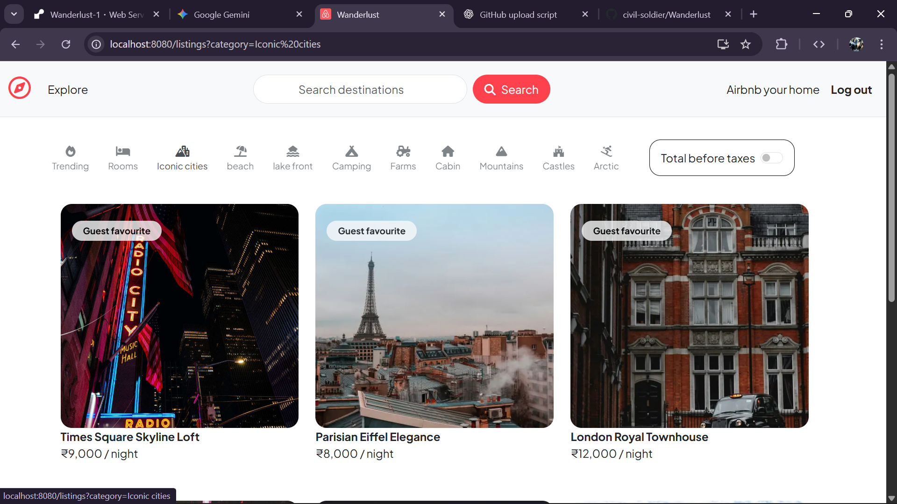
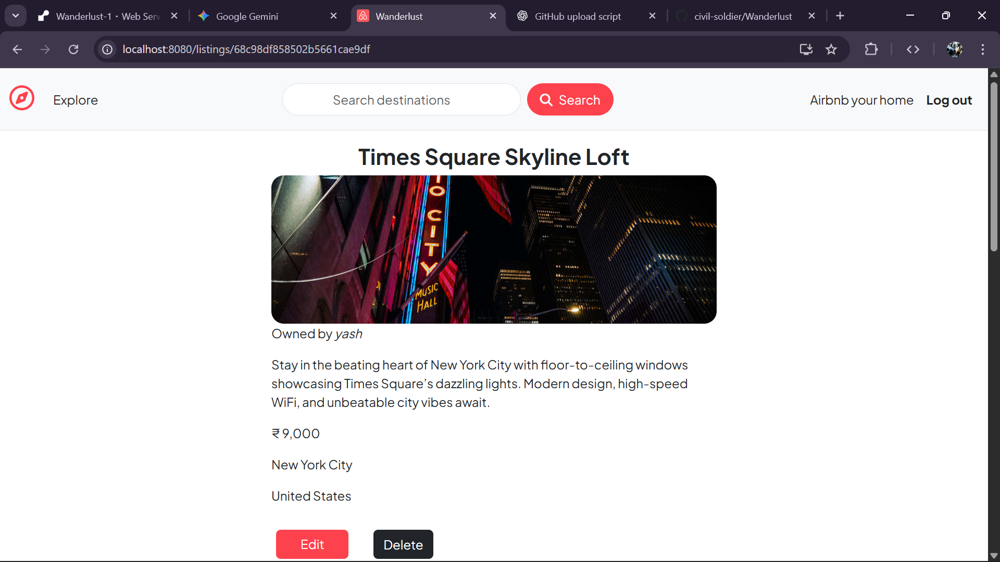
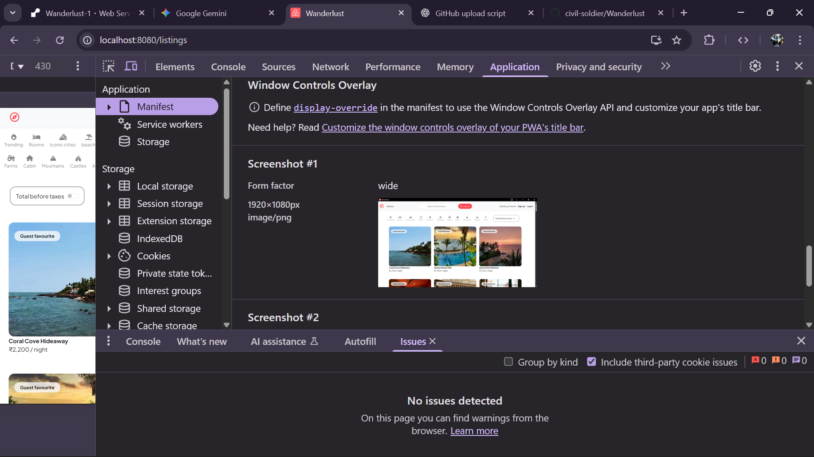
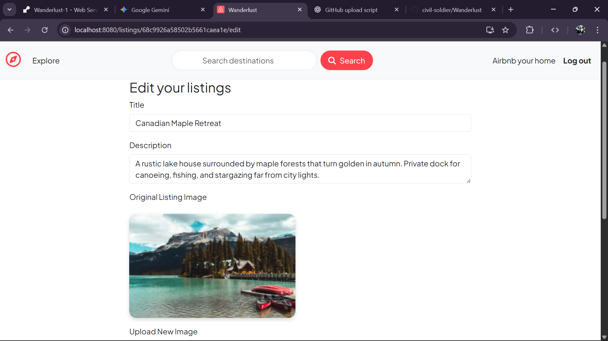
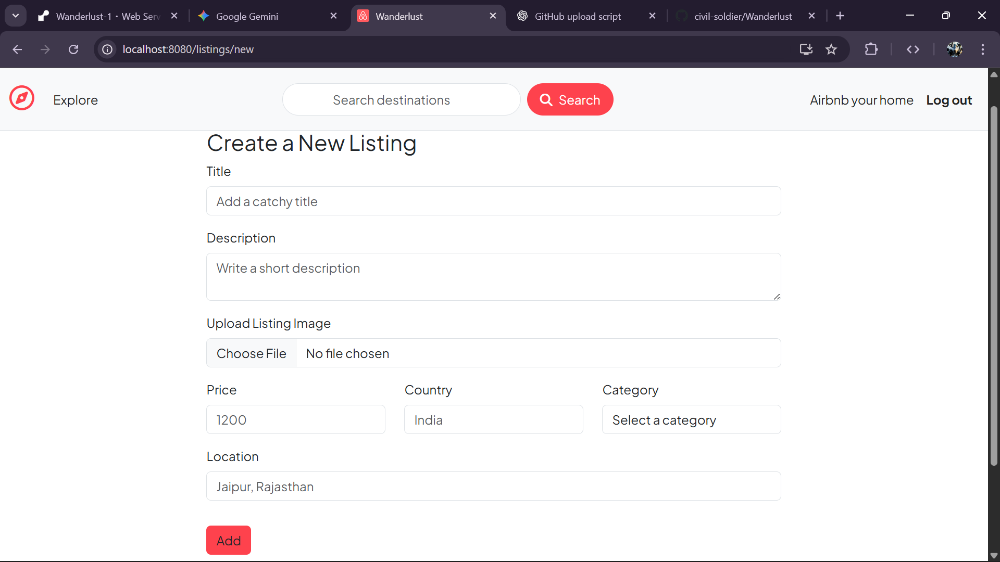

# 🌍 Wanderlust – Full-Stack Stay & Room Booking Platform

## 🧭 Overview

**Wanderlust** is a full-stack web application designed to let users **explore, list, and manage stays, rooms, and vacation rentals**, similar to Airbnb.  
It connects **owners** who want to rent their properties with **travelers** searching for stays, providing a modern, responsive interface with secure backend functionality.  

The platform leverages **Node.js**, **Express.js**, **MongoDB**, **EJS**, **Bootstrap**, and **Cloudinary**, and includes **Progressive Web App (PWA)** features for an installable, offline-ready experience.

[🌐 Live Demo]((https://wanderlust-2-l64v.onrender.com))

---

## ✨ Features

### 🏡 Core Platform Features
- 🧾 **Property Listings (CRUD):** Owners can create, view, update, and delete stays and rooms.  
- 📍 **Location-Based Search & Filter:** Find properties by city, category, or price.  
- 👤 **Owner Management:** Each listing is linked to an owner profile.  
- 📸 **Cloudinary Integration:** Optimized image upload, storage, and delivery for faster performance.  
- 🔐 **Authentication & Security:**  
  - Passwords hashed for security  
  - **Passport.js** authentication  
  - Cookie-based sessions for persistent login  
- ⚙️ **Custom Middlewares:** Validation, authorization, and error handling implemented server-side.  

### 📱 Progressive Web App (PWA)
- ✅ **Service Worker Registered:** Enables offline functionality.  
- 📦 **Smart Caching:** Critical assets cached for fast load times.  
- 🛠️ **Manifest Integration:** Proper icons and metadata for installation.  
- 🖼️ **Enhanced Install Prompt:** Uses `screenshots` and `form_factor` for richer UI.  
- 📲 **Installable on Desktop & Mobile.**

### 📄 Additional Pages
- 🔒 **Privacy Policy & Terms of Service:** Provides transparency and compliance for users.

---

## 🏆 Summary of Success

You have successfully:

✅ **Registered a Service Worker:** Browser recognizes the service worker.  
✅ **Configured Caching:** `sw.js` caches static assets correctly.  
✅ **Fixed File Paths:** 404 errors for icons and manifest resolved.  
✅ **Enabled the PWA Experience:** Browser identifies the website as a PWA.  
✅ **Implemented a Richer UI:** Added `screenshots` and `form_factor` for enhanced installation prompts.

---

## 🛠️ Tech Stack

**Frontend:** EJS, Bootstrap  
**Backend:** Node.js, Express.js  
**Database:** MongoDB (Mongoose)  
**Authentication:** Passport.js, bcrypt, cookie-session  
**Cloud & Media:** Cloudinary  
**PWA:** Service Worker, Web Manifest, Caching APIs  

---

## 📸 Screenshots & Previews

### 🏠 Home Page

### 🏡 show Page

### 📲 PWA Install Prompt

### Edit Page

### Create Page

---

## 🧪 Future Roadmap
- Booking & payment integration  
- Reviews & ratings for listings  
- Map-based property search  
- Wishlist/favorites feature  

---

## 📜 License
This project is open-source and available under the [MIT License](LICENSE).

---

## 👨‍💻 Author
**Yash Kumar** – Full-Stack Developer  
📧 Email: ([Email](krajeevranjan290@gmail.com))
🌐 Portfolio: ([www.linkedin.com](https://www.linkedin.com/in/yash-kumar-3495302a5/))

⭐ Check out the [live app](https://wanderlust-1-anj6.onrender.com) to explore Wanderlust in action!
